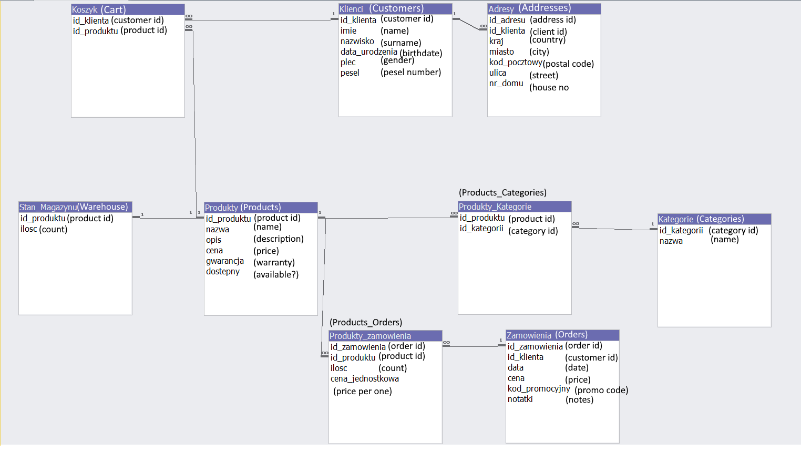

# Online-Shop-Management-System-MS-Access-VBA
# 🛒 Online Shop Management System (MS Access + VBA)

## 📌 Project Overview
The **Online Shop Management System** is a Microsoft Access database application built with **VBA (Visual Basic for Applications)**.  
It manages customers, products, orders, and inventory while automating certain tasks.  
The project demonstrates database relationships, form-based data entry, reporting, and VBA programming.

This project is designed as a **major academic project** and can also be used as a starting point for small business inventory and sales management systems.

---

## 🎯 Features
- **Customer Management**
  - Store personal and contact details.
  - Link customers with multiple addresses.
- **Product Management**
  - Maintain product details, categories, prices, warranties, and availability.
- **Inventory (Warehouse) Management**
  - Track product stock levels.
  - Link warehouse stock directly with products.
- **Order Management**
  - Create and manage customer orders.
  - Add multiple products to a single order.
  - Track order prices, quantities, and promo codes.
- **VBA Automation**
  - Automates form actions.
  - Supports event-driven operations.
  - Can be extended for reports, alerts, and calculations.
- **Reports**
  - Generate product lists, customer lists, and sales orders.

---

## 🗄 Database Design

### **Main Tables**
| Table Name | Description |
|------------|-------------|
| **Klienci (Customers)** | Stores customer details like name, birthdate, gender, and personal ID. |
| **Adresy (Addresses)** | Stores customer addresses (linked to Customers). |
| **Produkty (Products)** | Stores product details like name, description, price, warranty, and availability. |
| **Kategorie (Categories)** | Stores product category names. |
| **Stan_Magazynu (Warehouse)** | Tracks stock quantities for each product. |
| **Zamowienia (Orders)** | Stores order-level details such as customer, date, price, promo code, and notes. |
| **Produkty_Zamowienia (Products_Orders)** | Stores product details for each order including quantity and price per unit. |
| **Koszyk (Cart)** | Links customers to products they intend to purchase. |
| **Produkty_Kategorie (Products_Categories)** | Links products to categories (many-to-many relationship). |

---

## 🖥 Database Relationship Diagram
Below is the Entity Relationship Diagram (ERD) showing the tables and their relationships.

---

## 📊 User Interface
The system includes:
- **Forms** for entering customers, products, and orders.
- **Navigation forms** for switching between modules.
- **Reports** for printing invoices, product lists, and customer data.

---

## 🛠 Technologies Used
- **Microsoft Access** (`.accdb`)
- **VBA (Visual Basic for Applications)**
- **SQL Queries** for data retrieval and processing

---

## 🚀 How to Use
1. Open `Online Shop.accdb` in **Microsoft Access** (2010 or later).
2. Enable **content/macros** when prompted so VBA code runs correctly.
3. Use the provided forms to manage customers, products, orders, and warehouse inventory.
4. View and print reports as needed.

---

